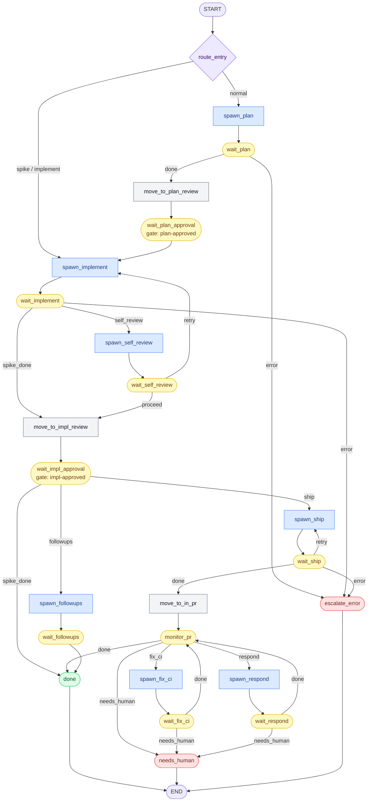

# AgecticPipeline

An AI-powered GitHub Project automation system that continuously polls a project board and orchestrates Claude AI agents through a structured development workflow — from planning through implementation to shipping — across multiple repositories.

## Overview

AgecticPipeline watches a GitHub Project board and automatically drives tickets through AI-assisted stages. Human review gates keep a developer in the loop at key checkpoints, while the daemon handles the repetitive work: running LangGraph graph threads per ticket, managing git worktrees, detecting completion, and moving tickets forward.

The workflow is encoded as a checkpointed LangGraph `StateGraph`. Each ticket runs as an independent graph thread persisted to SQLite — resuming correctly after crashes without re-triggering completed stages.

```
Backlog → AI Planning → [Human Review] → AI Implementation → Self Review
       → [Human Review] → Ready To Ship - AI → In PR
       → monitor_pr → [CI fail → AI-PR Assistance → fix → monitor_pr]
                    → [comments-approved → AI-PR Assistance → respond → monitor_pr]
                    → Done
```

## Architecture

| File/Dir | Purpose |
|----------|---------|
| `pipeline_poller.py` | Daemon. Polls GitHub Project board, drives LangGraph threads, manages worktrees, transitions ticket statuses. |
| `agentic_dev_pipe.py` | CLI. Start/stop/restart daemon, monitoring commands, graph visualizer. |
| `github_api.py` | GitHub GraphQL and REST utilities (project board, issues, labels, PRs, Actions). |
| `graph/state.py` | `TicketState` TypedDict — the graph thread state shape. |
| `graph/nodes.py` | All node implementations (spawn, wait, move, route). |
| `graph/workflow.py` | `StateGraph` builder + Mermaid visualizer. |

The daemon runs as a macOS launchd service (`dev.juan.pipeline-poller`).

## Workflow

### Graph Topology



Node color key: **blue** = AI spawn · **yellow** = interrupt/wait · **gray** = board move · **green** = success terminal · **red** = error terminal · **purple** = router

### Board Statuses

| Status | Owner | Description |
|--------|-------|-------------|
| Backlog | Human | Unstarted tickets |
| AI Planning | AI | Claude generates an implementation plan |
| Ready to Review then Plan | Human | Review gate — approve with `plan-approved` label |
| AI Implementation | AI | Claude executes the plan in an isolated worktree |
| Ready to review Implementation | Human | Review gate — approve with `impl-approved` label |
| Ready To Ship - AI | AI | Claude prepares and ships the PR |
| In PR | Human | PR open, awaiting merge / monitoring CI |
| AI-PR Assistance | AI | Claude is actively fixing CI or implementing review comments |
| Error | Human | Unrecoverable error or retry limit reached |
| Done | — | Complete |

### Human Gates

| Gate | Label | Trigger | What happens |
|------|-------|---------|--------------|
| Plan approval | `plan-approved` | `Ready to Review then Plan` | Advances to AI Implementation |
| Impl approval | `impl-approved` | `Ready to review Implementation` | Advances to shipping |
| Review comments | `comments-approved` | `In PR` | Ticket → AI-PR Assistance, AI implements PR comments, returns to In PR |
| Spike follow-ups | `followup-approved` | `Ready to review Implementation` (spike only) | AI creates follow-up tickets, closes spike as Done |

The poller removes all approval labels after consuming them.

### Completion Detection

Claude agents signal completion by posting an HTML comment marker on the GitHub issue:

| Marker | Stage |
|--------|-------|
| `<!-- ai-plan:done -->` | Planning finished |
| `<!-- ai-impl:done -->` | Implementation finished |
| `<!-- ai-self-review:done -->` | Self-review passed |
| `<!-- ai-ship:done -->` | Shipping finished |
| `<!-- ai-fix-ci:done -->` | CI fix applied |
| `<!-- ai-respond:done -->` | Review comments addressed |
| `<!-- ai-followups:done -->` | Follow-up tickets created |

The poller only counts markers posted after the spawn timestamp, preventing stale comments from triggering false completions.

### Spike Tickets

Tickets labeled `spike` follow an abbreviated path:

- Skips planning — goes directly to AI Implementation.
- Skips self-review and shipping.
- After impl review: `impl-approved` → Done; `followup-approved` → AI creates follow-up tickets → Done.
- Uses the `/spike-tickets` Claude skill instead of the normal implementation skill.

### Self-Review

Inserted between implementation and human review for non-spike tickets:

1. Claude reviews its own implementation against the plan.
2. Runs an internal code review (`/grindr_code_review` on Android, `/code-review` elsewhere).
3. If review fails, loops back to implementation (max 2 retries).

### CI Auto-Fix

When a PR's GitHub Actions run fails, `monitor_pr` classifies the failure:

- **In-scope** (lint, formatting, compilation, test flake on current-branch changes): ticket → `AI-PR Assistance`, Claude fixes and pushes, posts a comment with fix summary + commit link, ticket returns to `In PR`, CI re-runs.
- **Out-of-scope** (pre-existing failure, infra issue, unrelated test): Claude posts an explanation comment, ticket → `Error`.
- Max 3 in-scope fix attempts before escalating to `Error`.

### PR Review Comment Responder

When human adds `comments-approved` label while ticket is `In PR`:

1. Ticket → `AI-PR Assistance`.
2. Claude fetches all unresolved PR comments and implements the requested changes.
3. Claude replies `"Done"` on each comment thread it addressed.
4. Ticket returns to `In PR`, `comments-approved` label removed.
5. After 2 unresolved rounds → escalates to `Error`.

## Features

### LangGraph Checkpointing

Each ticket runs as a separate LangGraph thread with a unique `thread_id`. State is persisted to SQLite via `SqliteSaver` at `~/.pipeline/graph_checkpoints.db`. On daemon restart, tickets resume from their last completed graph node — no work is lost or re-triggered.

### Git Worktree Management

For each implementation task, the poller:

1. Fetches `origin/master` to ensure it is current.
2. Creates an isolated git worktree at `~/.pipeline/worktrees/{ticket_number}/`.
3. Creates a branch named `juanocampovgr/{ticket_number}`.
4. Cleans up the worktree and branch after the stage completes.
5. Force-cleans existing branches if a ticket is re-queued.

### Spawn Modes

- **Headless** (Planning, Self-Review) — Async subprocess; output captured to per-run log files in `~/.pipeline/logs/`.
- **Terminal** (Implementation, Shipping, CI Fix, Review Response) — Opens a Terminal.app window via AppleScript so the developer can watch the live session.

### Per-Repo Concurrency

Each repository (Android, iOS, Backend) has its own concurrency budget (`MAX_CONCURRENT_PER_REPO`, default 1). This prevents two Android tickets from creating conflicting worktrees simultaneously, while still allowing Android and Backend to run in parallel.

### Session Guards

Before spawning a new Claude process for a ticket, the poller kills any existing Claude processes associated with it (SIGTERM with 3-second grace, then SIGKILL) to prevent duplicate sessions.

### Stale Spawn Detection

If a spawned task produces no completion marker within a configurable threshold, the poller flags it as stale. Thresholds:

| Stage | Default |
|-------|---------|
| Planning | 15 minutes |
| Implementation | 60 minutes |
| Self-Review | 15 minutes |
| Shipping | 30 minutes |
| CI Fix | 20 minutes |
| Review Response | 30 minutes |

Stale spawns appear in the `metrics` command output with elapsed time vs. threshold.

### State Persistence

Two complementary persistence layers:

- **LangGraph SQLite** — `~/.pipeline/graph_checkpoints.db` — primary source of truth, full node-level checkpoint per ticket.
- **Legacy state.json** — `~/.pipeline/state.json` — kept in sync from graph state for backwards compatibility with existing monitoring commands.

### Error Handling & Recovery

- Missing repo path → posts a failure comment, moves ticket to **Error**.
- Worktree creation failure → posts a failure comment, moves ticket to **Error**.
- Terminal spawn failure → posts a failure comment, moves ticket to **Error**.
- GitHub GraphQL errors → retried with exponential backoff (2s, 4s, 8s).
- Auth errors (401/403) → fail fast, no retry.
- Self-review failures → re-implement loop (max 2 retries before Error).
- CI fix failures → fix loop (max 3 retries before Error).
- Review comment loops → max 2 rounds before Error.

## CLI Reference

```
agentic-dev-pipe <command>
```

| Command | Description |
|---------|-------------|
| `start` | Load the launchd plist and start the daemon |
| `stop` | Unload the launchd plist and stop the daemon |
| `restart` | Stop then start the daemon |
| `status` | Show daemon PID, last/next poll time, and active tickets |
| `metrics` | Show ticket counts by status and stale spawn warnings |
| `logs` | Tail all per-run AI output logs |
| `poller` | Tail the daemon's own heartbeat log |
| `errors` | Show recent error/warning lines from the poller log |
| `graph` | Print a Mermaid diagram of the current workflow graph |

## Claude Skills

| Skill | Trigger | Description |
|-------|---------|-------------|
| `/plan-github-tickets` | AI Planning stage | Generates implementation plan, posts to issue |
| `/code-tickets` | AI Implementation stage | Executes plan in worktree, opens interactive Terminal session |
| `/self-review-ticket` | Self-Review stage | Reviews implementation against plan, runs code review |
| `/ship-tickets` | Ship stage | Creates and pushes PR |
| `/fix-ci-failure` | CI auto-fix | Fetches CI logs, classifies and fixes in-scope failures |
| `/respond-to-review` | PR comment response | Implements unresolved PR review comments |
| `/spike-tickets` | Spike implementation | Research spike, post findings as issue comment |

## Configuration

Set via environment variables or a `.env` file in the pipeline root.

### Required

| Variable | Description |
|----------|-------------|
| `PROJECT_OWNER` | GitHub user or org owning the project board |
| `PROJECT_NUMBER` | Project board number |
| `PROJECT_NODE_ID` | GraphQL node ID of the project |
| `STATUS_FIELD_ID` | GraphQL node ID of the status field |
| `GITHUB_TOKEN` | GitHub PAT (falls back to `gh auth token`) |

### Optional

| Variable | Default | Description |
|----------|---------|-------------|
| `CLAUDE_BIN` | `claude` | Path to the Claude CLI binary |
| `ANDROID_REPO_PATH` | — | Local path to the Android repository |
| `IOS_REPO_PATH` | — | Local path to the iOS repository |
| `BACKEND_REPO_PATH` | — | Local path to the Backend repository |
| `POLL_INTERVAL_SECONDS` | `120` | How often to poll the board (seconds) |
| `MAX_CONCURRENT_PER_REPO` | `1` | Maximum simultaneous AI spawns per repository |
| `STALE_PLAN_SECONDS` | `900` | Stale threshold for planning (seconds) |
| `STALE_IMPL_SECONDS` | `3600` | Stale threshold for implementation (seconds) |
| `STALE_SHIP_SECONDS` | `1800` | Stale threshold for shipping (seconds) |
| `PIPELINE_DIR` | `~/.pipeline` | Root directory for state and logs |
| `STATE_FILE` | `~/.pipeline/state.json` | Legacy state persistence file |
| `LOG_DIR` | `~/.pipeline/logs` | Per-run log directory |

## Requirements

- macOS (uses launchd, Terminal.app, AppleScript)
- Python 3.10+
- [`langgraph`](https://github.com/langchain-ai/langgraph) + `langgraph-checkpoint-sqlite`
- [`anthropic`](https://github.com/anthropics/anthropic-sdk-python)
- [`httpx`](https://www.python-httpx.org/)
- [`gh`](https://cli.github.com/) CLI, authenticated
- `git` with worktree support
- `claude` CLI in PATH

## Runtime File Locations

| Path | Purpose |
|------|---------|
| `~/.pipeline/graph_checkpoints.db` | LangGraph SQLite checkpoint store (primary state) |
| `~/.pipeline/state.json` | Legacy ticket state (synced from graph for CLI compat) |
| `~/.pipeline/poller.log` | Daemon heartbeat and error log |
| `~/.pipeline/logs/` | Per-run AI output logs |
| `~/.pipeline/worktrees/{n}/` | Isolated git worktrees per ticket |
| `~/Library/LaunchAgents/dev.juan.pipeline-poller.plist` | launchd service definition |
