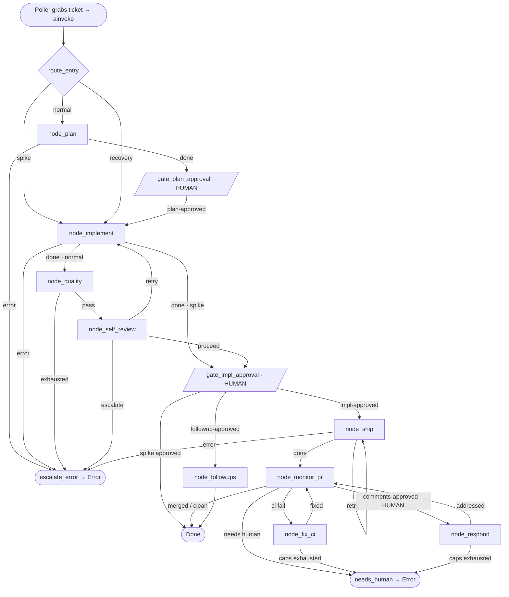
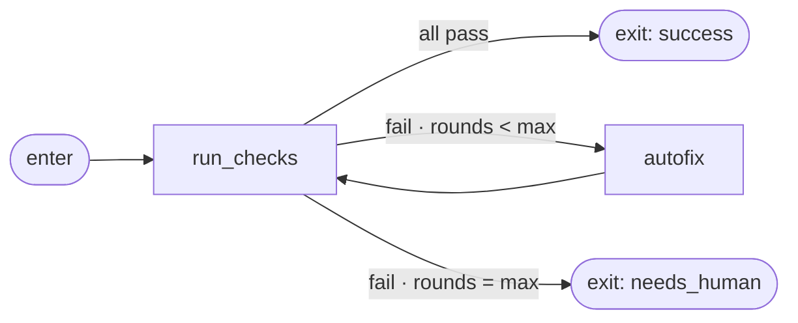
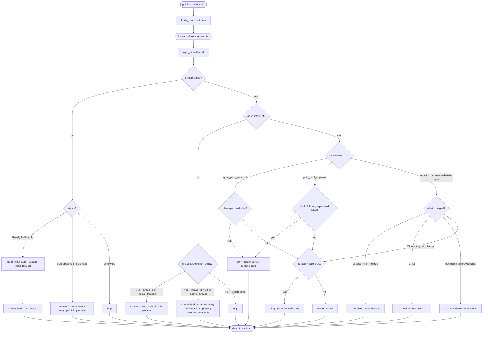

# Refactor: LangGraph-Native, Stateful Agentic Pipeline

## Context

Today the pipeline (`pipeline_poller.py` + `graph/`) uses LangGraph only as a **thin state machine**, not as the executor:

- Each stage is a `spawn_*` node (fires an external Claude CLI process and returns immediately) followed by a `wait_*` node that calls `interrupt("waiting_X_marker")`.
- The **poller** (`reconcile_once` / `_handle_interrupt`, ~230 lines) does the real orchestration: every 120s it scrapes GitHub issue comments for HTML markers (`<!-- ai-impl:done -->`), checks labels and CI, and resumes the graph with `Command(resume=...)`.
- The pipeline's real **memory** — the plan, what was implemented, quality results — lives in GitHub comments, **not** in graph state. `plan_content` exists in `TicketState` but is never populated.
- State (`graph/state.py`) is ~47 flat fields mixing domain data with 10 private `_*_outcome` routing flags; plus a legacy `~/.pipeline/state.json` shadow.

**Goal:** make LangGraph *execute* the pipeline (graph owns stage completion detection and routing), shrink the poller to ticket discovery + init + human-in-the-loop approvals, and introduce a structured **memory/state** layer that durably holds the critical context (initial request, approved plan, implementation branch, quality state, …). The GitHub board remains the human-facing progress tracker (status moves + artifact comments continue).

### Decisions locked with the user
1. **Completion signal = structured JSON result files.** Each skill writes a JSON artifact to a known path; nodes await that file. Marker-scraping leaves the poller. Skills still post human-readable comments/artifacts and the board still advances through statuses.
2. **Keep the visible macOS Terminal window** for implementation; nodes await the **result file** (not the PID), so process parentage no longer matters.
3. **Memory = per-ticket thread state now + a small cross-ticket `Store`** for repo profiles (paths/conventions).
4. **Greenfield reset:** clear `~/.pipeline/graph_checkpoints.db` and cut over to the new graph. No checkpoint migration. (Drain any human-tracked in-flight tickets manually first.)

Additional recommendation baked in: switch checkpointer SQLite → `AsyncPostgresSaver` is **out of scope** for v1 (greenfield SQLite is fine for a single-process dev daemon); noted as a follow-up.

---

## Target architecture

### Graph topology (Mermaid)



Each machine node performs its own board status transition as a side effect (board keeps
tracking progress), awaits its JSON result file, writes memory, and routes via
`Command(goto=, update=)`.

**Interrupt points — three categories:**

| Node | Type | Who resumes it | Signal |
|---|---|---|---|
| `gate_plan_approval` | human gate | poller | `plan-approved` label |
| `gate_impl_approval` | human gate | poller | `impl-approved` / `followup-approved` label |
| `monitor_pr` | **external-state gate** | poller | CI status (GitHub check-runs API) OR `comments-approved` label OR PR merged |

`monitor_pr` is the **one explicit exception** to the result-file rule. CI status is produced by
GitHub Actions workflows we do not control — there is no Claude skill to spawn, no result file to
await. The node calls `interrupt("waiting_pr_outcome")` and the poller detects all three outcomes:
- `fetch_ci_status()` → pass/fail/pending (GitHub check-runs REST API)
- PR merged/closed → `done`
- `comments-approved` label → `respond`

This is the correct boundary: result-file awaiting applies to stages where *we* spawn a Claude
skill. Passive observation of external async state (CI, PR status) belongs in the poller's poll
loop, exactly as it does today. The poller resumes `monitor_pr` with
`Command(resume={"outcome": "done"|"fix_ci"|"respond"|"needs_human"})`.

Reusable **`verify_and_autofix`** subgraph (used by `node_quality`, `node_ship`, `node_fix_ci`):



### 1. New State / Memory schema (`graph/state.py`)

> **Design constraint:** LangGraph only fires reducers on **top-level** `TicketState` keys. A
> `merge_dict` reducer on a nested group does `{**old, **new}` — which silently overwrites any
> inner list. `Annotated[list, add]` placed *inside* a nested TypedDict has no effect; LangGraph
> never sees it. Therefore all append-only lists must live at the top level of `TicketState`.

Pattern:
- **Nested groups with `merge_dict`** — for all overwrite fields. Partial updates patch the group,
  never clobber siblings. The sub-TypedDict is purely organisational; the field-level `Annotated`
  inside is just a type hint, not a reducer.
- **Top-level `Annotated[list, add]`** — for every field that must accumulate (not overwrite).
  Six such fields, all promoted out of their logical groups.

```python
# graph/state.py
from operator import add
from typing import Annotated, Literal, TypedDict


def merge_dict(old: dict | None, new: dict | None) -> dict:
    """Shallow patch-merge. Safe only for overwrite fields — never put list-append
    fields inside a group using this reducer; they must live at the top level."""
    return {**(old or {}), **(new or {})}


# ── Overwrite-only groups (all fields are safe to overwrite) ──────────────────

class Identity(TypedDict, total=False):
    ticket_number: int
    item_id: str
    issue_node_id: str
    repo: str
    repo_full: str
    repo_local_path: str       # resolved once via Store, reused by all stages
    is_spike: bool
    labels: list[str]
    jira_ticket_id: str
    entry_point: Literal["plan", "implement"]


class RequestMemory(TypedDict, total=False):
    initial_request: str           # MEMORY 1 — issue title+body at thread start
    initial_request_url: str
    approved_plan: str             # MEMORY 2 — full plan text (re-captured on re-plan)
    approved_plan_comment_url: str
    plan_revision: int


class QualityResult(TypedDict, total=False):
    check: Literal["detekt", "lint", "unit_tests"]
    passed: bool
    fixes_applied: bool
    error: str


class Implementation(TypedDict, total=False):
    branch: str                    # MEMORY 3
    worktree_path: str             # transient; "" when cleaned
    files_changed: list[str]
    impl_summary: str
    self_review_passed: bool
    self_review_retry_count: int
    # commit_shas is NOT here — it's a top-level Annotated field (append-only)


class Quality(TypedDict, total=False):
    checks: list[QualityResult]    # MEMORY 4 — latest run, overwrite each time
    affected_modules: list[str]
    # quality_history is NOT here — it's a top-level Annotated field (append-only)


class Ship(TypedDict, total=False):
    pr_number: int
    pr_url: str
    ship_mode: Literal["runner", "local"]
    ci_status: Literal["pass", "fail", "pending", "done", "unknown"]
    ci_fix_count: int


class Review(TypedDict, total=False):
    review_comment_round: int
    open_thread_ids: list[str]
    # responded_thread_ids is NOT here — top-level Annotated field


class Spike(TypedDict, total=False):
    research_doc_url: str
    # followup_tickets is NOT here — top-level Annotated field


class RunRecord(TypedDict, total=False):
    stage: str
    run_id: str
    started_at: float
    finished_at: float
    outcome: Literal["done", "error", "needs_human", "timeout", "crash"]
    result_path: str               # path to the JSON artifact the skill wrote


class Control(TypedDict, total=False):
    current_stage: str
    last_run: RunRecord            # latest RunRecord (overwrite)
    # run_history and errors are NOT here — top-level Annotated fields


# ── Top-level TicketState ─────────────────────────────────────────────────────

class TicketState(TypedDict, total=False):
    # ── Nested overwrite groups (merge_dict reducer patches, never clobbers) ──
    identity: Annotated[Identity, merge_dict]
    request:  Annotated[RequestMemory, merge_dict]
    impl:     Annotated[Implementation, merge_dict]
    quality:  Annotated[Quality, merge_dict]
    ship:     Annotated[Ship, merge_dict]
    review:   Annotated[Review, merge_dict]
    spike:    Annotated[Spike, merge_dict]
    control:  Annotated[Control, merge_dict]

    # ── Append-only lists at TOP LEVEL — reducers fire correctly here ─────────
    commit_shas:          Annotated[list[str], add]        # impl + autofix rounds
    quality_history:      Annotated[list[dict], add]       # MEMORY 4 audit — every quality run
    run_history:          Annotated[list[RunRecord], add]  # every stage's RunRecord
    errors:               Annotated[list[str], add]
    responded_thread_ids: Annotated[list[str], add]
    followup_tickets:     Annotated[list[int], add]
```

**Node update syntax** (how to write to a nested group AND append to a top-level list
in a single `Command`):

```python
return Command(
    goto="quality",
    update={
        # patch the nested group (merge_dict fires; other impl fields untouched)
        "impl": {"branch": res.branch, "files_changed": res.files_changed},
        # append to top-level list (add reducer fires)
        "commit_shas": res.commit_shas,
        "run_history": [res.record],
        "control": {"current_stage": "quality", "last_run": res.record},
    },
)
```

The 4 required memory items map to: `request.initial_request` (1), `request.approved_plan` (2),
`impl.branch` + `commit_shas` (top-level) + `impl.files_changed` (3),
`quality.checks` (latest) + `quality_history` (top-level audit) (4).

**Cross-ticket `Store`** (`graph/store.py`, compile with `store=...`): namespace
`("repo_profiles", repo)` with the following explicit schema:

```python
# All fields optional — absent fields fall back to constants in _base.py
{
    "repo_local_path":           str,   # e.g. "/Users/juan/grindr-android"
    "github_org":                str,   # e.g. "Grindr"
    "default_base":              str,   # e.g. "origin/master"
    "max_self_review_retries":   int,   # default: MAX_SELF_REVIEW_RETRIES   = 2
    "max_ci_fix_attempts":       int,   # default: MAX_CI_FIX_ATTEMPTS        = 3
    "max_review_response_rounds":int,   # default: MAX_REVIEW_RESPONSE_ROUNDS = 2
}
```

Removes the repo-resolution block copy-pasted into 4 spawn nodes and `_infer_repo_from_plan` in
the poller. All retry caps are co-located here so they're tunable per-repo without code changes.
(Defer learned-patterns / ticket-summaries to a later pass.)

### 1b. Module layout — one file per node (`graph/nodes/`)

```
graph/
├── state.py                  # nested TypedDicts + reducers
├── schemas.py                # Pydantic StageResult + per-stage result models (boundary validation)
├── store.py                  # repo_profiles Store helpers
├── runner.py                 # run_stage(), wait_for_result_file(), launch_visible_terminal()
├── workflow.py               # build_workflow(): import nodes, wire edges, compile
├── nodes/
│   ├── __init__.py           # re-exports every node callable for workflow.py
│   ├── _base.py              # shared helpers: move_status(), escalate(), resolve_worktree()
│   ├── route_entry.py
│   ├── plan.py               # node_plan + _capture_plan(), _post_plan_comment()
│   ├── gate_plan_approval.py # interrupt() gate
│   ├── implement.py          # node_implement + _setup_worktree(), _spike_branch()
│   ├── quality.py            # node_quality (drives verify_and_autofix)
│   ├── self_review.py        # node_self_review + retry-cap logic
│   ├── gate_impl_approval.py # interrupt() gate
│   ├── ship.py               # node_ship + _create_pr()
│   ├── monitor_pr.py         # node_monitor_pr (CI + comments-approved gate)
│   ├── fix_ci.py
│   ├── respond.py
│   ├── followups.py
│   └── terminals.py          # node_done, node_needs_human, node_escalate_error
└── subgraphs/
    ├── __init__.py
    └── verify_and_autofix.py # reusable check→autofix→recheck loop (Functional API)
```

**Per-file contract:** each node file exposes exactly one public
`async def node_x(state: TicketState) -> Command[Literal[...]]`; keeps stage-specific logic in
module-private `_helpers`; takes side-effecting clients (GitHub, git, subprocess launcher) via the
shared `_base`/`runner` modules (dependency-injected, mockable); validates skill output through
`schemas.py`; and has a sibling `tests/nodes/test_x.py`. **No node imports another node** — only
`_base`, `runner`, `state`, `schemas`, `store`. `workflow.py` is the single place edges are wired.

### 2. Collapse `spawn_*`+`wait_*` and kill `_*_outcome` (`graph/nodes.py`, `graph/workflow.py`)

Each machine stage becomes **one async node** that launches the skill, awaits its JSON result, writes memory, and routes via `Command(goto=, update=)` — no separate wait node, no `_*_outcome` field, no `route_*` helper:

```python
# graph/nodes/quality.py
async def node_quality(state: TicketState) -> Command[Literal["self_review", "escalate_error"]]:
    res = await run_stage(state, "AI Quality Check")   # idempotent — see §2a
    if res.outcome == "error":
        return Command(goto="escalate_error",
                       update={"errors": [res.error],
                               "run_history": [res.record],
                               "quality": {"checks": res.checks}})
    return Command(goto="self_review",
                   update={"quality": {"checks": res.checks, "affected_modules": res.modules},
                           "quality_history": [res.model_dump()],
                           "run_history": [res.record],
                           "control": {"current_stage": "self_review", "last_run": res.record}})
```

### 2a. `run_stage()` idempotency (`graph/runner.py`)

> **Gap fixed:** `launch_visible_terminal` is not idempotent. If LangGraph re-enters a node
> after a process restart or checkpoint resume, the Terminal would re-launch, running the skill
> twice. The old code guarded this with `last_run_id`/`last_fired_at`; the new design removes
> those fields and replaces the guard with a deterministic filesystem check.

**Rule: `result_path` is a pure function of values already in state before the node runs.**

```python
# graph/runner.py

def compute_result_path(state: TicketState, stage: str) -> Path:
    """Deterministic path — same (ticket, stage, attempt) always maps to the same file.
    Attempt counter disambiguates repeated stages (retry/loop stages get distinct paths)."""
    ticket  = state["identity"]["ticket_number"]
    attempt = _attempt_for_stage(state, stage)
    slug    = stage.lower().replace(" ", "_")
    return RESULTS_DIR / str(ticket) / f"{slug}_{attempt}.json"

def _attempt_for_stage(state: TicketState, stage: str) -> int:
    """Repeated stages need distinct result paths so old results aren't re-used."""
    impl   = state.get("impl") or {}
    ship   = state.get("ship") or {}
    review = state.get("review") or {}
    return {
        "ai_implementation": impl.get("self_review_retry_count", 0),
        "fix_ci":            ship.get("ci_fix_count", 0),
        "respond_to_review": review.get("review_comment_round", 0),
    }.get(stage.lower().replace(" ", "_"), 0)


async def run_stage(state: TicketState, stage: str, context: dict) -> StageResult:
    result_path = compute_result_path(state, stage)

    if result_path.exists():
        # Re-entry guard: a previous launch already wrote (or is writing) this file.
        raw = _try_read_complete(result_path)   # returns None if file incomplete
        if raw:
            return StageResult.model_validate(raw)  # complete — return without re-launching
        # File exists but incomplete (skill crashed mid-write) — don't re-launch;
        # await will time out and produce a crash sentinel → node escalates normally.
        return await _wait_and_parse(result_path, timeout=STALE_THRESHOLD[stage])

    # Fresh entry: launch and await
    _launch_visible_terminal(state, stage, result_path, context)
    return await _wait_and_parse(result_path, timeout=STALE_THRESHOLD[stage])
```

**Re-entry scenarios handled:**

| Re-entry scenario | File state | Behaviour |
|---|---|---|
| Crash before skill finished | absent or incomplete | Absent → re-launch; incomplete → await times out → escalate |
| Crash after skill wrote, before `Command` returned | complete | Read and return — no re-launch |
| Spurious resume on a completed stage | complete | Same as above |
| Fresh first entry | absent | Launch normally |

`last_run_id` and `last_fired_at` are **removed from state** — `result_path` (deterministic
from stable state values) and the filesystem are the idempotency mechanism.

- Delete all `_*_outcome`, `pr_outcome`, `impl_approval_type` from state; delete every `route_*`
  in `nodes.py:574-645` and the matching `add_conditional_edges` in `workflow.py`. Keep
  `route_entry` (spike/normal/recovery) as the one remaining conditional edge.
- The `Literal[...]` return annotation keeps `draw_mermaid()` / `visualize_workflow()` rendering edges.
- **Human-gate nodes keep `interrupt()`** — only machine routing moves to `Command`. All code
  before `_launch_visible_terminal` must be side-effect-free (reads only); the filesystem check
  in `run_stage` ensures the launch itself is idempotent.

### 3. Reusable `verify_and_autofix` subgraph and retry caps

`quality-check`, `ship`-verify, and `fix-ci` share the shape: run checks → if fail and
rounds < N → autofix → re-run → escalate on exhaustion. Extract one compiled subgraph used at all
three sites. Implement it with the Functional API (`@entrypoint`/`@task`) — a clean bounded loop —
while the top-level pipeline stays Graph API.

#### Retry cap strategy (applies to `verify_and_autofix` AND `node_self_review`)

All retry caps are **named constants in `graph/nodes/_base.py`** with an **optional per-repo
Store override**. This is the single source of truth — no more magic `>= 2` / `>= 3` buried in
routing functions. Self-review is explicitly included alongside the `verify_and_autofix` caps.

```python
# graph/nodes/_base.py  — safe defaults; Store can override per repo
MAX_SELF_REVIEW_RETRIES    = 2
MAX_CI_FIX_ATTEMPTS        = 3
MAX_REVIEW_RESPONSE_ROUNDS = 2

def get_retry_caps(store, repo: str) -> dict:
    profile = (store.get(("repo_profiles", repo)) or {})
    return {
        "max_self_review_retries":    profile.get("max_self_review_retries",    MAX_SELF_REVIEW_RETRIES),
        "max_ci_fix_attempts":        profile.get("max_ci_fix_attempts",        MAX_CI_FIX_ATTEMPTS),
        "max_review_response_rounds": profile.get("max_review_response_rounds", MAX_REVIEW_RESPONSE_ROUNDS),
    }
```

The pipeline works correctly even when no `repo_profiles` Store entry exists (new repo,
unconfigured) — the constants provide the fallback. The Store makes them tunable per-repo without
code changes.

`node_self_review` calls `get_retry_caps(store, repo)` exactly like the `verify_and_autofix`
subgraph does — there is no reason for the self-review cap to differ in mechanism. The
`repo_profiles` Store schema (§1 cross-ticket Store) must therefore include all three cap fields:
`max_self_review_retries`, `max_ci_fix_attempts`, `max_review_response_rounds`.

### 4. New Poller ⇄ Graph boundary (`pipeline_poller.py`)

**Poller keeps (thin):**
- `fetch_board()` discovery each cycle.
- **Init / grab**: `Ready To Pick Up` + no thread → build initial state (now capturing `request.initial_request` from `fetch_issue_body`) → `ainvoke`. Recovery start preserved.
- **Human-in-the-loop resume only**: detect `plan-approved`, `impl-approved`, `followup-approved`, `comments-approved` labels (and the `comments-approved` branch of PR monitoring) → `Command(resume=...)`. These are genuinely external/async, so polling them stays correct.
- A liveness watchdog for tickets parked at human gates too long.
- Drive tickets with `asyncio.gather` (bounded by existing per-repo / total semaphores at `pipeline_poller.py:232-250`) since nodes now block for the duration of a stage.

**Moves into the graph (out of the poller):** all machine-stage completion detection — `waiting_*_marker` branches, `_spawn_errors`, `last_fired_at`/`last_run_id`, `INTERRUPT_TO_STAGE`, machine `STALE_THRESHOLD`, the CI-status branch of `waiting_pr_outcome`, and worktree management (now `_base.resolve_worktree`). `_handle_interrupt` shrinks to ~50 lines (human labels only). Remove `state.json` shadow + `_sync_legacy_state`; `agentic_dev_pipe` status reads from checkpoints/Store instead.

**The poller = the graph's I/O edge with the outside world.** Three jobs only:
1. **Discover & grab** — `fetch_board()`; new `Ready To Pick Up` ticket → `asyncio.create_task(_run_thread(...))` to start a graph thread (plus plan-approved recovery start).
2. **Drive interrupt gates** — for any thread parked at an interrupt, detect the appropriate signal and `Command(resume=...)`. Two gate types:
   - *Human gates* (`gate_plan_approval`, `gate_impl_approval`): poll GitHub labels, clear on detect.
   - *External-state gate* (`monitor_pr`): poll CI status via `fetch_ci_status()`, PR merged status, and `comments-approved` label. This is the **one non-human interrupt** the poller still owns — CI status is external async state (GitHub Actions), not a Claude skill result file.
3. **Supervise** — task set bounded by semaphores; watchdog tickets parked too long at any gate.

Any thread at a *machine node* (not at an interrupt) is a plain `skip` **if it has an active task
in this process**. On poller restart (no active task), it is re-invoked (see §4a below).

### 4a. Poller restart recovery and `_active_threads`

> **Gap fixed:** `asyncio` tasks are lost on process restart. After restart, any thread with
> `snapshot.next` and no active task must be re-invoked — `run_stage()`'s idempotency check (§2a)
> then handles whether to re-launch the Terminal or read an already-written result file.

Machine nodes block for up to an hour, so `ainvoke` calls must be **`asyncio.create_task`**, not
`await`ed inline — keeping the poll loop nimble. A process-local `_active_threads: set[str]`
tracks live tasks and is the restart-vs-running discriminator.

```python
# pipeline_poller.py
_active_threads: set[str] = set()

async def _run_thread(workflow, thread_id: str, input_) -> None:
    _active_threads.add(thread_id)
    try:
        await workflow.ainvoke(input_, {"configurable": {"thread_id": thread_id}})
    finally:
        _active_threads.discard(thread_id)

async def reconcile_once(workflow, ...):
    for item in await fetch_board():
        thread_id = str(item["ticket_number"])
        snapshot  = await workflow.aget_state({"configurable": {"thread_id": thread_id}})

        if not snapshot or not snapshot.values:
            if item["status"] == "Ready To Pick Up":
                asyncio.create_task(_run_thread(workflow, thread_id, initial_state))
            continue

        if _is_at_interrupt(snapshot):
            await _handle_gate(snapshot, item, workflow)   # human labels + monitor_pr
            continue

        if snapshot.next and thread_id not in _active_threads:
            # Restart recovery: thread has pending work but no live task in this process.
            # Pass None — LangGraph resumes from the last checkpoint. run_stage() idempotency
            # handles whether to re-launch the Terminal or read an already-written result file.
            asyncio.create_task(_run_thread(workflow, thread_id, None))
        # else: thread_id in _active_threads → node is running in this process, skip
```

**Three cases on poller restart:**

| Thread state at restart | `snapshot.next` | `_active_threads` | Action |
|---|---|---|---|
| Mid machine-stage (node was running) | non-empty | empty (new process) | `create_task` re-invokes |
| At human/external-state gate | empty (`tasks` has interrupt) | empty | `_handle_gate` as normal |
| Fully done or at END | empty | empty | skip |

The Terminal window (macOS, grandchild of Terminal.app) is **unaffected by poller restart**. If
the skill finishes and writes its result file while no node is awaiting it, the file sits on disk
until the re-invoked node enters `run_stage()` and finds it — returning immediately without
re-launching.



### 5. Skills write structured result artifacts (`.claude/commands/*.md`)

Each skill, as its **final step**, writes its already-computed JSON to `$PIPELINE_RESULT_PATH` (env var the spawner sets, e.g. `~/.pipeline/results/{ticket}/{stage}.json`), with an error/`{"outcome":"error"}` sentinel on failure. The data already exists internally (`code-tickets` Phase 3 returns `{branch_name, files_changed, ...}`; `quality-check` Phase 3 collects per-check `{check, passed, fixes_applied}`) — today it's discarded. **Skills also keep posting their human-readable comment and the board still advances statuses** (board stays the tracking surface, per decision #1). The HTML marker becomes optional UX, no longer the control signal.

---

## Implementation steps (greenfield cutover)

1. **State + schemas**: rewrite `graph/state.py` to the nested schema + reducers; add `graph/schemas.py` with Pydantic `StageResult`/per-stage result models for boundary validation.
2. **Executor**: add `graph/runner.py` — `run_stage()`, `wait_for_result_file()`, `launch_visible_terminal()` (refactor of `spawn_terminal`); keep the visible window.
3. **Store + base**: add `graph/store.py` (`repo_profiles`) and `graph/nodes/_base.py` (`move_status()`, `escalate()`, `resolve_worktree()`); collapse the 4 duplicated repo-resolution blocks (`nodes.py:99-178, 273-330, 366-421, 431-486`) into the Store-backed `resolve_worktree`.
4. **Subgraph**: build `graph/subgraphs/verify_and_autofix.py` (Functional API loop, retry caps from Store).
5. **Nodes (one file each)**: create `graph/nodes/*.py` per the layout — each a single `Command`-returning async node with module-private helpers; delete all `route_*` + `_*_outcome`. `graph/nodes/__init__.py` re-exports them.
6. **Workflow**: rewrite `graph/workflow.py` `build_workflow()` to import from `graph.nodes` and wire the collapsed topology; keep `visualize_workflow()`.
7. **Skills**: add the result-file write step to each `.claude/commands/*.md` (plan, code-tickets, quality-check, self-review-ticket, ship-tickets, ship-tickets-with-runner, spike-tickets, fix-ci-failure, respond-to-review). Skills keep posting board comments/artifacts and statuses still advance.
8. **Poller**: gut `_handle_interrupt` to human-gate branches; switch the per-ticket loop to `asyncio.gather` (bounded by existing semaphores); capture `initial_request` at init; remove `state.json`/`_sync_legacy_state`, `_spawn_errors`, marker/staleness machinery.
9. **Tests**: `tests/nodes/test_*.py` per node (mock `_base`/`runner`); subgraph loop test; reducer/`StageResult` unit tests; full stubbed-`run_stage` graph dry-run (non-spike, spike, error, self-review-retry).
10. **Cutover**: stop the daemon, archive & delete `~/.pipeline/graph_checkpoints.db`, restart on the new graph.

---

## Verification

- **Unit**: state reducers (append vs overwrite, group merge), `StageResult` validation, `wait_for_result_file` timeout/sentinel handling.
- **Graph**: `visualize_workflow()` renders the new topology; compile with `MemorySaver` and dry-run a non-spike thread with stubbed `run_stage` (fake result files) through plan→…→done; repeat for spike and for an error/escalation path and a self-review-retry loop.
- **Memory**: after a stubbed run, assert `aget_state` shows `request.initial_request`, `request.approved_plan`, `impl.branch`, `quality.checks`, and `control.run_history` populated.
- **End-to-end (staging board)**: run one real low-risk ticket through plan → human `plan-approved` → implement (watch the Terminal window) → quality → self-review → human `impl-approved` → ship → PR; confirm the board advances statuses and artifact comments post, and that the poller never scrapes markers (logs).
- **Poller boundary**: confirm `_handle_interrupt` only fires on the four human labels; kill a skill mid-stage and confirm the node times out via `wait_for_result_file` and escalates.

## Out of scope (follow-ups)
- Postgres checkpointer migration.
- Cross-ticket learned-patterns / ticket-summary memory in the Store.
- Replacing the visible Terminal window with headless+log-mirroring.
